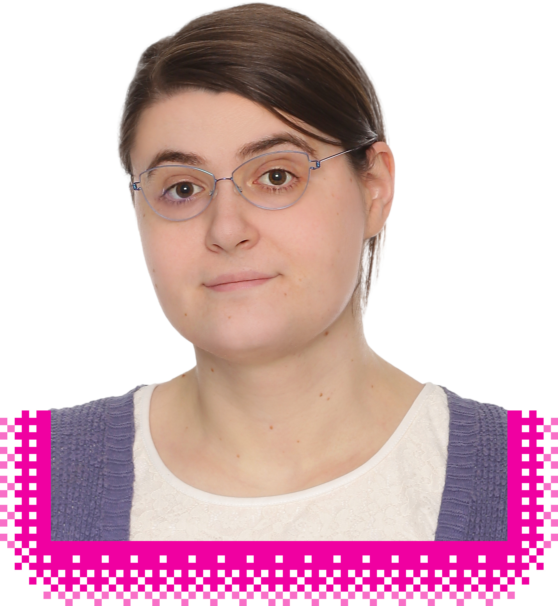

<picture id="portrait-container">
  <source
    srcset="
      assets/images/portrait-128px.webp 128w,
      assets/images/portrait-256px.webp 256w,
      assets/images/portrait-512px.webp 512w,
      assets/images/portrait.webp"
    sizes="40vw" />
  
</picture>

My name is Maria Szegedy. I am a graduate from Rutgers University with a triple
major in biomedical engineering, molecular biology, and physics. I also have
several qualifications in computer science, and a lifelong passion for both
fields. Being early in my career, I have been focusing on gaining experience
through freelance and pro-bono work, but I am now looking for a more permanent
position. I also aspire to relocate to the United Kingdom to be closer to my
family.

I have lived in many different cultures and countries throughout my life, which
I believe gives me vital experience collaborating with others and building
strong relationships. It also equips me to handle change, travel, and
instability whenever they arise in my work. Outside of my career, I am
passionate about cooking, using it to connect with the cultures I have lived in.
I have developed a culinary style from a blend of Hungarian and Southern Chinese
cuisines, and I love cooking for others. Additionally, I enjoy video games and
art, and have worked on various creative projects in my free time.
